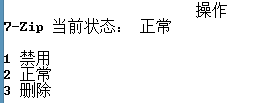

# windows右键菜单管理器

## 前言

原本以为非常简单的一个小脚本，结果踩坑无数...

利用python标准库 [_winreg](https://docs.python.org/2/library/_winreg.html)

代码写的烂勉强能用233，还是做点科普工作，顺便翻译一点API

## 什么是右键菜单

如下图

随着软件的安装下载，你的右键菜单会渐渐臃肿，什么360, 7zip, qq等可能会出现在你的右键菜单里。

这时候你想删掉一些根本用不到的栏目，又不想单独安装管理软件。

那么你就需要 win+R 输入 regedit 手动删除无用的注册表项

不过在这之前。先要有一些基本的认识。

右键菜单分多少类呢？

大致如下：桌面，文件，文件夹，软件，磁盘等

每一类对应的注册表中一个或多个的位置

例如文件夹相关的注册表至少有

可以看这个篇[文章](https://www.howtogeek.com/howto/windows-vista/how-to-clean-up-your-messy-windows-context-menu/)，会有个大概的认识。或者自行百度一波..

## 然后呢

文章里讲到。

shell项下的栏目，可以通过新建值 Extended 或 LegacyDisable 来 隐藏或者禁用。或者直接删除。

隐藏的意思是。shift+右键是才会显示。

shellex/ContextMenuHandles项下的栏目，是加密的？谨慎删除。可以通过修改数据来禁用，例如在原有数据前加入`-` ，将数据改为`--{23170F69-40C1-278A-1000-000100020000}`

## show

这是原本的情况。可以对文件进行7-zip

然后运行我们的代码 `python main.py`

输入 3 回车

输入 3 回车

输入 1 回车

完成~

## code 

_winreg是python标准库中用来操作window注册表的库。（因为是标准库所以不需要额外的安装吧？）

也有其他库来做，可以解决一些平台兼容的问题。偷懒没去研究0 0

http://www.jb51.net/article/63644.htm 有一点demo，格式乱了2333

之后把我用到的几个接口，介绍一下。挖个坑放着~

## 几个坑

1. regedit里不会自动刷新，这里有个刷新，请记得点

   

2. 部分操作需提供管理员权限，so在管理员权限下运行代码

   举例操作方式：win+x，选择命令提示符(管理员)

   

3. `_winreg.OpenKey`的第4个参数，为该句柄提供权限。默认的权限不能修改键值...

   例如：`key = _winreg.OpenKey(_winreg.HKEY_CLASSES_ROOT, subkey, 0, _winreg.KEY_ALL_ACCESS)`

   `_winreg.KEY_ALL_ACCESS`是最大的权限啦。（第三个参数不明，似乎填0就ok）

## 参考

windows报错信息：http://www.mamicode.com/info-detail-346240.html

对应注册表位置：https://jingyan.baidu.com/article/363872ec39aa3c6e4aa16f70.html

对应注册表位置：https://jingyan.baidu.com/article/d45ad148b3c3aa69542b804a.html

_winreg demo：http://www.jb51.net/article/63644.htm

老外的科普文：https://www.howtogeek.com/howto/windows-vista/how-to-clean-up-your-messy-windows-context-menu/

